<div align="center">

<!-- Animated Header Banner -->


<!-- Typing Animation -->
<a href="https://git.io/typing-svg">
  
</a>

<br/>

<!-- Social Badges — clean labels only -->
[](https://www.linkedin.com/in/jashwanth-marisetty-26947631a/)
[](https://github.com/JashwanthMarisetty)
[](mailto:jashwanthmarisetty217@gmail.com)
[](https://leetcode.com/u/JashwanthMarisetty_21/)
[](https://www.codechef.com/users/codewizard_18)
[](https://codeforces.com/profile/Jass___)

<br/>


</div>

---

## 🧠 About Me

```typescript

const jashwanth = {
  name: "Marisetty Jashwanth",
  college: "IIIT Jabalpur — B.Tech CSE (2022–Present)",
  role: "Backend Developer",
  location: "Jabalpur, India 🇮🇳",

  currentlyBuilding: [
    "🧱 Formula Builder — Full-stack form engine with AI spam detection",
    "🚛 Smart Truck — K-means clustering for last-mile logistics",
    "📦 Bhandara App — Hyperlocal food-event platform (Play Store ✅)",
  ],

  techStack: {
    languages: ["JavaScript", "TypeScript", "C++"],

    frontend: [
      "React.js",
      "HTML",
      "CSS",
      "Tailwind CSS"
    ],

    backend: [
      "Node.js",
      "Express.js",
      "RESTful APIs"
    ],

    databases: [
      "PostgreSQL",
      "MongoDB",
      "MySQL"
    ],

    cache_and_messaging: [
      "Redis",
      "RabbitMQ"
    ],

    devOps_and_tools: [
      "Docker",
      "Git",
      "Firebase"
    ],

    cloud_and_apis: [
      "Firebase FCM",
      "Google Maps API"
    ],

    ai_ml: [
      "HuggingFace Toxic-BERT"
    ],
  },

  achievements: {
    jee: "98.6 Percentile — JEE Main 2022 (Top 1.4% of 1M+ students)",
    leetcode: "Rating 1833 | Rank 767 in Weekly Contest 482 (40K+ participants)",
    codechef: "3⭐ | Rating 1671",
    codeforces: "Specialist | Rating 1423",
  },

  funFact: "I shipped a production-ready form builder from a 36-hour hackathon MVP 🏆",
};
```

---

## 🛠️ Tech Stack & Tools

<div align="center">

### Languages


### Backend


### Databases


### DevOps & Tools


### Frontend


</div>

---

## 🚀 Featured Projects

<div align="center">

### 🧱 Formula — Intelligent Form Builder

</div>

> **Stack:** `Node.js` · `Express.js` · `MongoDB` · `Redis` · `RabbitMQ` · `React.js` · `HuggingFace API`

| Feature | Details |
|---|---|
| 🤖 **AI Spam Detection** | Toxic-BERT NLP model classifies submissions across **6 toxicity categories** in real-time |
| 📍 **Location Analytics** | Google Maps & Geocoding APIs for geographic response heatmaps |
| ⚡ **Performance** | Redis caching + compound MongoDB indexes → **20–30% latency reduction** |
| 🔐 **Security** | OTP auth · Google reCAPTCHA · Redis rate limiting |
| 📬 **Async Notifications** | RabbitMQ handles **10+ concurrent email events** without blocking |
| 📊 **QR Sharing** | QR-based form distribution with real-time response collection |
| 🏆 **Origin** | 36-hour hackathon MVP → evolved into a production-ready system |

[](https://formula-builder-frontend.onrender.com)
[](https://github.com/JashwanthMarisetty/formula-builder)

---

<div align="center">

### 🚛 Smart Truck — Logistics Optimization System

</div>

> **Stack:** `Node.js` · `PostgreSQL` · `C++` · `K-Means Clustering`

| Feature | Details |
|---|---|
| 📦 **Clustering** | K-Means groups **50+ delivery locations** into geographic zones automatically |
| 🗺️ **Zone Consolidation** | Merges small zones (<15 packages) within 10 km radius to prevent truck underutilization |
| ⚡ **Parallel Routing** | Assigns dedicated trucks per zone enabling parallel execution |
| 📉 **Optimization** | Reduces overall delivery time via density-aware geographic partitioning |

[](https://github.com/JashwanthMarisetty/Smart-Truck)

---

<div align="center">

### 📱 Bhandara App — Hyperlocal Community Platform

</div>

> **Stack:** `Node.js` · `Express.js v5` · `MongoDB` · `Firebase FCM` · `Razorpay`

| Feature | Details |
|---|---|
| 🌍 **Production Live** | Available on **Play Store** and **App Store** across India |
| 🍱 **Domain** | Discovering & organizing free community food events (hyperlocal) |
| 🔔 **Push Notifications** | Firebase FCM for real-time event updates |
| 💳 **Payments** | Razorpay integration for seamless in-app transactions |

---

<div align="center">

### 🎓 Fusion — Examination & Grade Management System

</div>

> **Stack:** `Node.js` · `PostgreSQL` · `JWT` · `RESTful APIs`

| Feature | Details |
|---|---|
| 🏫 **Users** | Faculty, administrators & students at IIIT Jabalpur |
| 📊 **Bulk Processing** | CSV upload/validation handling **270+ student records** per batch |
| 📜 **Transcripts** | Auto-generated with SPI & CPI computation for **400+ students** |

---

## 🏆 Achievements & Competitive Programming

<div align="center">

| Platform | Achievement |
|:---:|:---|
| 🎯 **JEE Main 2022** | **98.6 Percentile** — Top 1.4% among 1,000,000+ candidates across India |
| 🟠 **LeetCode** | Rating **1833** · Ranked **767** in Weekly Contest 482 (40,000+ participants) |
| ⭐ **CodeChef** | **3 Star** · Rating **1671** |
| 🟣 **Codeforces** | **Specialist** · Rating **1423** |

</div>

---

## 📊 GitHub Statistics

<div align="center">


<br/>


<br/>

<!-- GitHub Trophies -->


<br/>

<!-- Contribution Graph -->


</div>

---

## 🐍 Contribution Snake

<div align="center">

<picture>
  <source media="(prefers-color-scheme: dark)" srcset="https://raw.githubusercontent.com/JashwanthMarisetty/JashwanthMarisetty/output/github-contribution-grid-snake-dark.svg" />
  <source media="(prefers-color-scheme: light)" srcset="https://raw.githubusercontent.com/JashwanthMarisetty/JashwanthMarisetty/output/github-contribution-grid-snake.svg" />
  
</picture>

</div>

---
## 🏙️ GitHub City & Skyline

<div align="center">



<br/>


</div>

---


</div>
